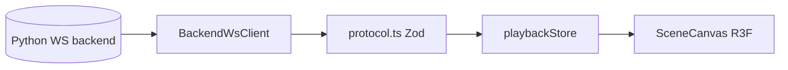

# Architecture

## Layers

```
src/
  app/           AppShell layout and UI-only Zustand (uiStore)
  domain/        Simulation protocol, WebSocket client, playback store
  features/      React UI by capability (scene, controls, connection, metrics)
  language/      Lezer grammar for .problem files
```

## Data flow



## WebSocket lifecycle

1. **Connect**: `BackendWsClient` to `VITE_WS_URL`
2. **Generate scene**: `generate_scene` with functional spec + domain YAML → `generated_scene`
3. **Load scenario**: `load_scenario_file` → `preview_trajectory_chunk`(s)
4. **Initialize simulation**: `initialize_simulation` → `initial_state`
5. **Run**: `start_simulation` → `simulation_trajectory_chunk`(s) and live `frame` pushes

Preview and simulation trajectories are stored separately in `playbackStore` for side-by-side analysis.

## Performance

Large trajectory chunks may be merged in a **Web Worker** (`mergeFrames.worker.ts`) before updating the store. Playback uses **requestAnimationFrame** for smooth time advancement.
